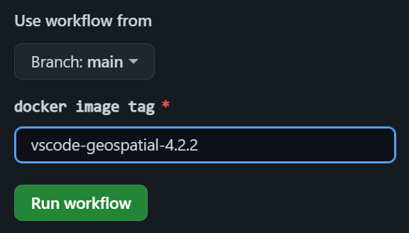

# Docker images for writing R and LaTeX in Visual Studio Code

## How to use

```sh
docker pull ghcr.io/junichiyamasaki/r-latex:vscode-geospatial-4.2.2
```

Devcontainer settings for the image can be found in [junichiyamasaki/r-latex-researchenv](https://github.com/junichiyamasaki/r-latex-researchenv)

## Image tags

### Base images (R & LaTeX)

All images are derived from [rocker-project](https://rocker-project.org/images/).

Note that these images contain all of the TeXLive packages and very slow to build.

- `verse-4.2.2`
- `geospatial-4.2.2`

### VSCode images

These images are dependent on the corresponding base images.

- `vscode-verse-4.2.2`
- `vscode-geospatial-4.2.2`

## Release

Manually run `Docker Build and Push` workflow with the target docker image tag. See [`.github/workflows/build_and_push.yml`](.github/workflows/build_and_push.yml) for details.


